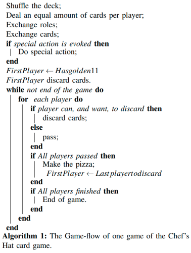
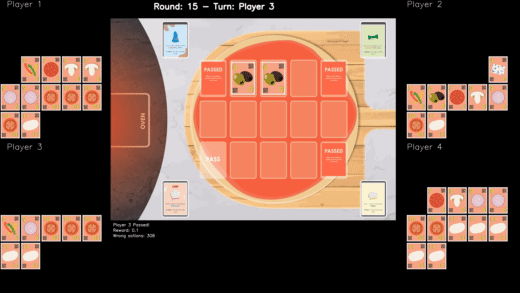
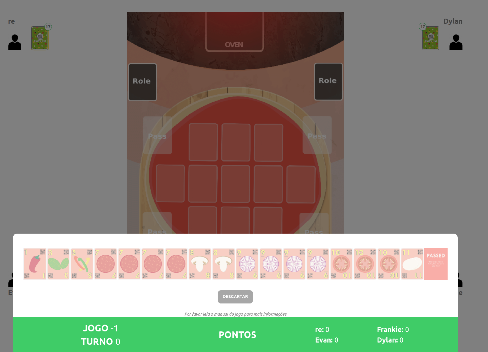

## Chef's Hat Card game

 

The Chef's Hat Environment provides a simple and easy-to-use API, based on the OpenAI GYM interface, for implementing, embedding, deploying, and evaluating reinforcement learning agents.

Fora a complete overview on the development of the game, refer to:

- It's Food Fight! Introducing the Chef's Hat Card Game for Affective-Aware HRI (https://arxiv.org/abs/2002.11458)
- The Chef's Hat rulebook  [The Chef's Hat rulebook.](gitImages/RulebookMenuv08.pdf)

If you want to have access to the game materials (cards and playing field), please contact us using the contact information at the end of the page.

#### Summary of game rules



During each game there are three phases: Start of the game, Making Pizzas, End of the game. The game starts with the cards been shuffled and dealt with the players. Then, starting from the second game, the exchange of roles takes place based on the last games'  finishing positions. The player who finished first becomes the Chef, the one that finished second becomes the Sous-Chef, the one that finished third becomes the Waiter and the last one the Dishwasher. Once the roles are exchanged, the exchange of the cards starts. The Dishwasher has to give the two cards with the highest values to the Chef, who in return gives back two cards of their liking. The Waiter has to give their lowest valued card to the Sous-Chef, who in return gives one card of their liking.

If, after the exchange of roles, any of the players have two jokers at hand, they can perform a special action: in case of the Dishwasher, this is "Food Fight" (the hierarchy is inverted), in case of the other roles it is "Dinner is served" (there will be no card exchange during that game).

Once all of the cards and roles are exchanged, the game starts. The goal of each player is to discard all the cards at hand. They can do this by making a pizza by laying down the cards into the playing field, represented by a pizza dough. The person who possesses a Golden 11 card at hand starts making the first pizza of the game. A pizza is done when no one can, or wants, to lay down any ingredients anymore. A player can play cards by discarding their ingredient cards on the pizza base. To play cards, they need to be rarer (i.e. lowest face values) than the previously played cards. The ingredients are played from highest to the lowest number, that means from 11 to 1. Players can play multiple copies of an ingredient at once, but always have to play an equal or greater amount of copies than the previous player did. If a player cannot (or does not want) to play, they pass until the next pizza starts. A joker card is also available and when played together with other cards, it assumes their value. When played alone, the joker has the highest face value (12). Once everyone has passed, they start a new pizza by cleaning the playing field, and the last player to play an ingredient is the first one to start the new pizza.


## Playing a Game

 

The game is controlled by a simple flow:

```python
    observations = env.reset()

    while not env.gameFinished:
        currentPlayer = playersAgents[env.currentPlayer]

        observations = env.getObservation()
        action = currentPlayer.getAction(observations)

        info = {"validAction":False}
        while not info["validAction"]:
            nextobs, reward, isMatchOver, info = env.step(action)
```
            
You can check it all in details in our [documentation.](https://chefshatgym.readthedocs.io/en/latest/)
 

### Instalation and Examples

Our documentation containing the instalation instructions, the entire game structure and coding examples can be accesed through our [readTheDocs.](https://chefshatgym.readthedocs.io/en/latest/)
 
### Chef's Hat Player's Club
 
The [Chef’s Hat Player’s Club](https://github.com/pablovin/ChefsHatPlayersClub) is a collection of ready-to-use artificial agents. Each of these agents were implemented, evaluated, and discussed in specific peer-reviewed publications and can be used at any time. If you want your agent to be included in the Player’s Club, send us a message.

 ### Chef's Hat Online
   
   
The [Chef’s Hat Online](https://github.com/pablovin/ChefsHatOnline) encapsulates the Chef’s Hat Environment and allows a human to play against three agents. The system is built using a web platform, which allows you to deploy it on a web server and run it from any device. The data collected by the Chef’s Hat Online is presented in the same format as the Chef’s Hat Gym, and can be used to train or update agents, but also to leverage human performance.
 
 ### Moody Framework
 
  
  
 [Moody Framework]( https://github.com/pablovin/MoodyFramework) is a plugin that endowes each agent with an intrinsic state which is impacted by the agent's
  own actions. 
 

 ## Use and distribution policy

All the examples in this repository are distributed under a Non-Comercial license. If you use this environment, you have to agree with the following itens:

- To cite our associated references in any of your publication that make any use of these examples.
- To use the environment for research purpose only.
- To not provide the environment to any second parties.

## Citations

- Barros, P., Sciutti, A., Bloem, A. C., Hootsmans, I. M., Opheij, L. M., Toebosch, R. H., & Barakova, E. (2021, March). It's Food Fight! Designing the Chef's Hat Card Game for Affective-Aware HRI. In Companion of the 2021 ACM/IEEE International Conference on Human-Robot Interaction (pp. 524-528).

- Barros, P., Tanevska, A., Yalcin, O., & Sciutti, A. (2021). Incorporating Rivalry in Reinforcement Learning for a Competitive Game. arXiv preprint arXiv:2011.01337.

- Barros, P., Tanevska, A., Cruz, F., & Sciutti, A. (2020, October). Moody Learners-Explaining Competitive Behaviour of Reinforcement Learning Agents. In 2020 Joint IEEE 10th International Conference on Development and Learning and Epigenetic Robotics (ICDL-EpiRob) (pp. 1-8). IEEE.

- Barros, P., Tanevska, A., & Sciutti, A. (2020). Learning from Learners: Adapting Reinforcement Learning Agents to be Competitive in a Card Game. arXiv preprint arXiv:2004.04000.

- Barros, P., Sciutti, A., Hootsmans, I. M., Opheij, L. M., Toebosch, R. H., & Barakova, E. (2020). It's Food Fight! Introducing the Chef's Hat Card Game for Affective-Aware HRI. Accepted at the HRI2020 Workshop on Exploring Creative Content in Social Robotics! arXiv preprint arXiv:2002.11458.


## Contact

Pablo Barros - pablo.alvesdebarros@iit.it

- [http://pablobarros.net](http://pablobarros.net)
- [Twitter](https://twitter.com/PBarros_br)
- [Google Scholar](https://scholar.google.com/citations?user=LU9tpkMAAAAJ)
